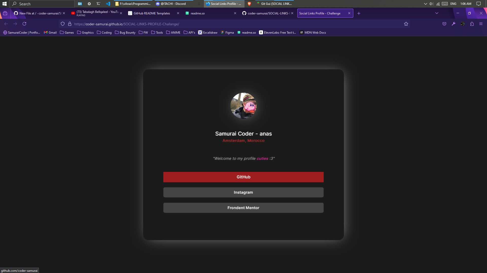

# Social Links Pofile - Challange
Frontend Mentor offers invaluable real-world web development challenges, sharpening my HTML, CSS, and JavaScript skills.

 
 

## the challenge:
 

 

## what i made:
 

